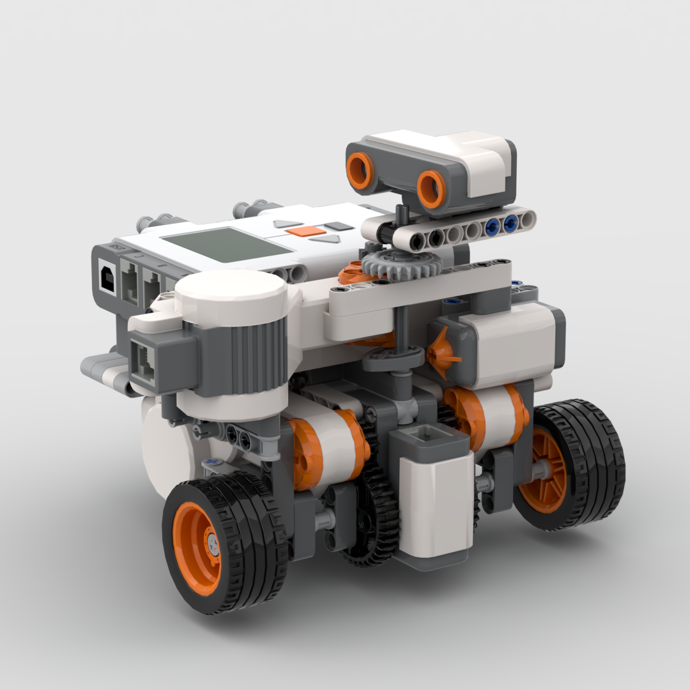
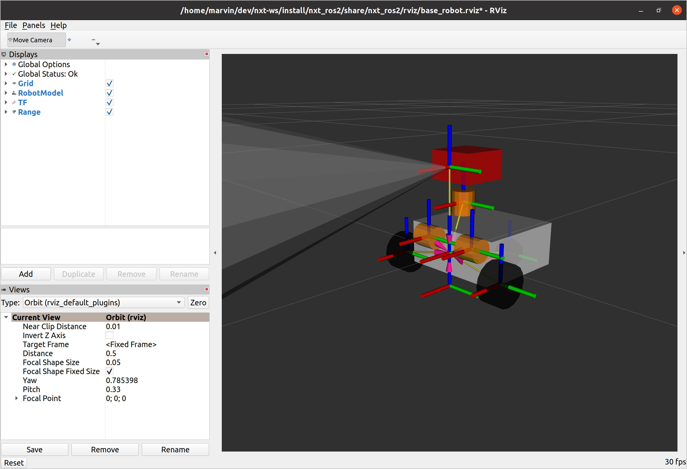
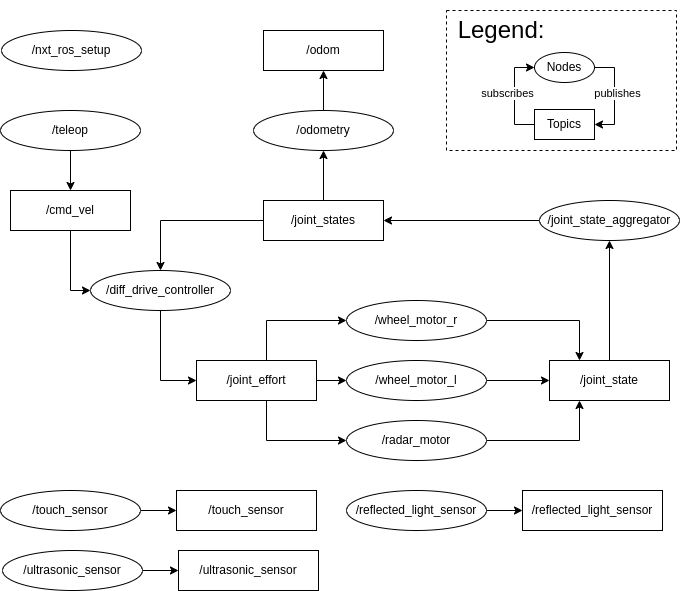

# nxt_ros2

A ROS 2 package for interacting with Lego Mindstorms NXT 2.0 robots via ROS 2 interfaces.

This package allows:

- configuring a robot and its ports via a single config file
- reading NXT sensor data via ROS 2 topics
- [running](https://ni.srht.site/nxt-python/latest/api/motor.html#nxt.motor.Motor.run) NXT motors via ROS 2 topics
- [turning](https://ni.srht.site/nxt-python/latest/api/motor.html#nxt.motor.BaseMotor.turn) NXT motors via ROS 2 actions
- reading motor positions via ROS 2 topics
- driving two-wheel differentially driven robots via keyboard
- retrieving odometry information of two-wheel differentially driven robots
- visualizing nxt robots in rviz

Internally, the package uses [nxt-python](https://github.com/schodet/nxt-python) to communicate with the NXT brick. The nxt_ros2 package is inspired by the original [nxt_ros](http://wiki.ros.org/nxt) ROS 1 package and serves as an updated and extended version.

# About this guide

**Scope:**

This readme explains:

- how to install the package
- how to configure sensors and motors used by the package
- how to launch the package
- how to interact with the NXT via the provided ROS 2 interfaces
- how to use the provided [base robot](#base-robot)
- how the package works internally and its architecture

The readme does not contain any internal API documentation. Check out the docstrings for further API details.

**Audience:**

This readme is primarily intended for software engineers with previous python experience.

Knowledge about the Robot Operating System 2 (ROS 2) is welcome but not expected. Explanations for ROS-specific concepts are linked throughout the readme. For better understanding, read through [these ROS 2 basics tutorials](https://docs.ros.org/en/foxy/Tutorials/Beginner-CLI-Tools.html).

# Getting started

## **Prerequisites**

- LEGO Mindstorms NXT 2.0 kit
- Ubuntu 20.04
- [Colcon](https://docs.ros.org/en/foxy/Tutorials/Beginner-Client-Libraries/Colcon-Tutorial.html#install-colcon)
- [ROS 2 foxy](https://docs.ros.org/en/foxy/Installation.html) (Installation recommended via [Debian packages](https://docs.ros.org/en/foxy/Installation/Ubuntu-Install-Debians.html))
- [Installed and initialized rosdep](https://docs.ros.org/en/foxy/Installation/Alternatives/Ubuntu-Install-Binary.html#installing-and-initializing-rosdep)
- [ROS 2 workspace](https://docs.ros.org/en/foxy/Tutorials/Beginner-Client-Libraries/Colcon-Tutorial.html#basics)
- [Configured environment](https://docs.ros.org/en/foxy/Tutorials/Beginner-CLI-Tools/Configuring-ROS2-Environment.html#configuring-environment)

## **Installation**

1. Go to `your_workspace/src`

   `cd your_workspace/src`

2. Clone the nxt_ros2 repository

   `git clone https://github.com/marvinknoll/nxt_ros2.git`

3. Clone the required nxt_msgs2 repository

   `https://github.com/marvinknoll/nxt_msgs2`

   Now `your_workspace` should have the following structure:

   ```bash
   .
   └── src
     ├── nxt_msgs2
     └── nxt_ros2
   ```

4. Switch back to `your_workspace`

   `cd ..`

5. Source the setup script as the [underlay](https://docs.ros.org/en/foxy/Tutorials/Beginner-Client-Libraries/Colcon-Tutorial.html#source-an-underlay)

   `source /opt/ros/foxy/setup.bash`

   > 💡 Note: You will need to run this command on **every new shell** you open to have access to the ROS 2 commands. The exact command depends on where you installed ROS 2 and which shell you use. (`setup.bash` | `setup.sh` | `setup.zsh`)

6. Install rosdeps

   `rosdep install -i --from-path src --rosdistro foxy -y`

7. Build the workspace

   `colcon build`

8. [Source the overlay](https://docs.ros.org/en/foxy/Tutorials/Beginner-Client-Libraries/Colcon-Tutorial.html#source-an-underlay)

   `source install/setup.bash`

   > You will also need to run this command on **every new shell** you open to have acces to the build package.

Now you are ready to test your installation with the [minimal example](#minimal-example).

> 🛠 If you get a permission error, please follow [this guide](https://ni.srht.site/nxt-python/latest/installation.html#usb-access-permissions-for-linux) for setting the correct permissions for your NXT connected via USB.

> 💡 The package automatically installs nxt-python as a dependency. nxt-python is responsible for all the communication with the nxt-brick. For more details on that library, check out its [repository](https://github.com/schodet/nxt-python), [documentation](https://ni.srht.site/nxt-python/latest/) and [mailing list](https://lists.sr.ht/~ni/nxt-python).

## **Minimal example**

In this minimal example, you will learn how to configure and launch the package to read the data measured from a touch sensor and how to control a motor.

First, connect the touch sensor to the NXT port “1” and a motor to port “A”. Then, connect the NXT brick to your PC via USB and make sure the NXT brick is powered on.

> 💡 Note: The entire code runs on the PC, not on the NXT brick. Therefore the NXT must be connected to the PC the whole time.

In your shell, go to `your_workspace` and ensure you’ve **sourced** **your underlay**. Also, make sure you have **built** your workspace and **sourced your overlay.**

To launch the entire package, run:

```bash
ros2 launch nxt_ros2 default.launch.py device_config_file:='/absolute/path/to/your_workspace/install/nxt_ros2/share/nxt_ros2/config/minimal.yaml'
```

Once launched, the package automatically starts a [ROS node](https://docs.ros.org/en/foxy/Tutorials/Beginner-CLI-Tools/Understanding-ROS2-Nodes/Understanding-ROS2-Nodes.html) for the touch sensor. This node reads the touch sensor every 0.3 seconds and [publishes](https://docs.ros.org/en/foxy/Tutorials/Beginner-Client-Libraries/Writing-A-Simple-Py-Publisher-And-Subscriber.html) the data to the `/touch_sensor` [topic](https://docs.ros.org/en/foxy/Tutorials/Beginner-CLI-Tools/Understanding-ROS2-Topics/Understanding-ROS2-Topics.html). Furthermore, it starts a node for the motor, which publishes the motor’s state to the `/joint_state` topic and enables you to control it.

The expected console output at this point is:

```bash
[nxt_ros-1] [INFO] [1659507612.987192887] [nxt_ros_setup]: Created sensor of type 'touch' with node name 'touch_sensor' on port 'Port.S1'
[nxt_ros-1] [INFO] [1659507613.008617785] [nxt_ros_setup]: Created motor of type 'other' with node name 'test_motor' on port 'Port.A'
[js_aggregator-2] [INFO] [1659507613.227195675] [joint_state_aggregator]: Got available motors configurations from nxt_ros_setup node
[diff_drive_controller-3] [INFO] [1659507613.227723813] [diff_drive_controller]: No wheel motors are defined. Stopping differential drive controller node
[odometry-4] [INFO] [1659507613.240165927] [odometry]: No 'wheel_motor_r' and 'wheel_motor_l' defined in config params. Stopping odometry node
```

To verify that the **sensor** topic is **available** and the touch sensor data is being **published**:

1. Open a new terminal
2. Navigate to `your_workspace`
3. Source the underlay and the overlay

   ```bash
   source /opt/ros/foxy/setup.bash && source install/setup.bash
   ```

4. List all topics that are being published

   ```bash
   ros2 topic list
   ```

   The expected console output is:

   ```bash
   /joint_effort
   /joint_state
   /joint_states
   /parameter_events
   /rosout
   /touch_sensor
   ```

   Note that the `/touch_sensor` topic is in the list

5. Echo messages being published to the `/touch_sensor` topic:

   ```bash
   ros2 topic echo /touch_sensor
   ```

   The messages published should look like this:

   ```bash
    header:
      stamp:
        sec: 1659596057
        nanosec: 626294858
      frame_id: ''
    touch: false
   ```

   Note how the messages contain `touch: false` if the sensor is released and `touch: **true**` if the sensor is pressed.

To verify that the **motor** state is being published and we can control the motor:

1. Open a new terminal
2. Navigate to `your_workspace`
3. Source the underlay and the overlay

   ```bash
   source /opt/ros/foxy/setup.bash && source install/setup.bash
   ```

4. List all topics that are being published

   ```bash
   ros2 topic list
   ```

   The expected console output is:

   ```bash
   /joint_effort
   /joint_state
   /joint_states
   /parameter_events
   /rosout
   /touch_sensor
   ```

   Note that the `/joint_state` topic is in the list

5. Echo messages being published to the `/joint_state` topic:

   ```bash
   ros2 topic echo /joint_state
   ```

   The messages should look like this:

   ```bash
    header:
      stamp:
        sec: 1659596191
        nanosec: 364759748
      frame_id: ''
    name:
    - test_motor
    position:
    - 0.0
    velocity:
    - 0.0
    effort:
    - 0.0
   ```

   Note how the message contains the name “test_motor”, position, velocity and effort of the motor.

6. To [turn](https://ni.srht.site/nxt-python/latest/api/motor.html#nxt.motor.BaseMotor.turn) the motor 360 degrees with power 100 and braking at the end of the motion send the following action goal:

   ```bash
   ros2 action send_goal /test_motor_turn nxt_msgs2/action/TurnMotor "{power: 100, tacho_units: 6.283185, brake: True, timeout: 1, emulate: True}"
   ```

   Note: If you now echo the `/joint_state` topic again, you will see that the position changed.

7. To [run](https://ni.srht.site/nxt-python/latest/api/motor.html#nxt.motor.Motor.run) the motor indefinitely with a certain amount of power, publish the effort/power to the `/joint_effort` topic and add the motor’s name (`test_motor`) to the message:

   ```bash
   ros2 topic pub /joint_effort nxt_msgs2/JointEffort "{joint_name: 'test_motor', effort: 50.0}" --once
   ```

8. To stop the motor from [running](https://ni.srht.site/nxt-python/latest/api/motor.html#nxt.motor.Motor.run) indefinitely, publish a message with the effort 0.0:

   ```bash
   ros2 topic pub /joint_effort nxt_msgs2/JointEffort "{joint_name: 'test_motor', effort: 50.0}" --once
   ```

If all the steps above worked, you have successfully installed ROS 2 foxy and the package nxt_ros2. You have seen how to launch the package, list all available topics, continuously echo sensor and motor data and how to make a motor [turn](https://ni.srht.site/nxt-python/latest/api/motor.html#nxt.motor.BaseMotor.turn), [run](https://ni.srht.site/nxt-python/latest/api/motor.html#nxt.motor.Motor.run) and stop.

You are ready to build your robot or use the [build instructions](./docs/base_robot_build_instructions.pdf) for the [base robot](#base-robot). The following steps are to configure the motors, sensors and robot dimensions. Once those are defined, you can [launch the package](#launching-the-package) and use the [provided interfaces](#provided-interfaces-to-communicate-with-the-nxt) to interact with your robot via ROS 2 interfaces.

# **Configuring motors, sensors and robot dimensions**

To configure the devices, we need to tell the package 2 main things:

1. What device is attached to which port
2. Device-specific configuration (e.g. max_range of an ultrasonic sensor)

All of this information gets passed to the package via [ROS 2 parameters](https://docs.ros.org/en/foxy/Tutorials/Beginner-CLI-Tools/Understanding-ROS2-Parameters/Understanding-ROS2-Parameters.html). Remember that ROS 2 parameters are node specific and can also be defined in a `.yaml` parameter file and passed to the nodes.

As an example, let’s look at the `base_robot.yaml` parameter file:

```yaml
# What device is attached to which port
/nxt_ros_setup:
  ros__parameters:
    devices:
      1:
        sensor_type: touch
        sensor_name: touch_sensor
      3:
        sensor_type: reflected_light
        sensor_name: reflected_light_sensor
      4:
        sensor_type: ultrasonic
        sensor_name: ultrasonic_sensor
        frame_id: radar_link
      A:
        motor_type: other
        motor_name: radar_motor
        motor_mimic_name: radar
        motor_mimic_gear_ratio: -0.33333
        invert_direction: false
      B:
        motor_type: wheel_motor_l
        motor_name: wheel_motor_l
        motor_mimic_name: wheel_l
        motor_mimic_gear_ratio: -0.33333
        invert_direction: true
      C:
        motor_type: wheel_motor_r
        motor_name: wheel_motor_r
        motor_mimic_name: wheel_r
        motor_mimic_gear_ratio: -0.33333
        invert_direction: true
    robot_dimensions:
      axle_track: 0.135
      wheel_radius: 0.022
      rad_per_s_to_effort: 5.86

# Device-specific configuration
/ultrasonic_sensor:
  ros__parameters:
    # Default values for LEGO Mindstorms NXT 2.0 ultrasonic sensor
    field_of_view: 0.5235988 # 30 degrees
    max_range: 2.54 # meters
    min_range: 0.07 # meters

/reflected_light_sensor:
  ros__parameters:
    rgb_color:
      - 0.0
      - 0.0
      - 0.0

/joint_state_aggregator:
  ros__parameters:
    related_js_time_delta: 1000000000 # nanoseconds
```

First, we define the parameters for the `nxt_ros_setup` node. Based on its initial parameters, this node will create an individual node for each device specified under the key: `devices`. Ports 1-4 are reserved for sensors, and ports “A”, “B”, and “C” are reserved for motors.

Each device needs to have a unique `sensor_name | motor_name`, which will also be the name of the device's individual node.

> ❗ Make sure to use the exact same hierarchy as in the example, namely:
> `/nxt_ros_setup` → `ros__parameters:` → `devices:` → `<PORT>` → …

## Sensors:

For the sensors, a `sensor_type` is mandatory and defines which sensor it is. The possible values are `touch`, `reflected_light`, `color` and `ultrasonic`. The optional `frame_id` field defines the `frame_id` of the measured data messages. If no `frame_id` is defined, the `frame_id` of the message will stay empty. The topic name to which the node will publish its measured data will be the same as the node's name.

## Motors:

For the motors, the mandatory `motor_type` defines whether the motor is the left or right drive-wheel motor or a normal motor (not used for differential driving). The valid values for `motor_type` are `wheel_motor_l` for the left drive wheel, `wheel_motor_r` for the right one and `other` for a normal motor. If you define a `wheel_motor_l`, you must also define a `wheel_motor_r` and vice versa. While multiple motors with `motor_type` `other` are allowed, more than two “wheel” motors are not allowed.

> 💡 Motors of the type ”wheel" and "other" do not differ physically, they differ only in the way they are handled by the package.

Note how there is also a `motor_mimic_name` and `motor_mimic_gear_ratio` defined for each motor. These two fields are mandatory and are used to describe motors where the wheel is not directly attached, but gears are in between. Use gear ratios < 1 if your wheel turns slower than the motor and > 1 if it turns faster. If you have the wheels directly attached to the motor, use 1 as the gear ratio. The sign of the gear ratio determines whether the wheel turns in the same direction as the motor. A positive gear ratio means it turns in the same direction and a negative in the opposite. The `motor_mimic_name` defines the name of the motor mimics joint published by the joint state publisher to `/joint_states`.

The field `invert_direction` can finally be used to define the orientation of the motor.


`invert_direction` configurations

## Robot dimensions:

Configuring the robot dimensions is only required if you have a two-wheel differentially driven robot and need the controller or odometry to work.

The field `axle-track` defines the distance between the left and the right wheel in meters. The `wheel_radius` is the wheel radius in meters. Finally, `rad_per_s_to_effort` defines the multiplier from radians per second to effort. If you use the motors that come with the Mindstorms NXT 2.0 robot, `5.86` is a good value for `rad_per_s_to_effort`.

> 💡 If you have a URDF file describing the robot, the values must match for the visualization to work properly.

## Device-specific configurations:

The ultrasonic and the reflected light sensor allow further sensor-specific configuration via node parameters. These parameters can also be configured in the parameter file. To configure the sensor nodes, declare parameters for the same name you gave the node via `sensor_name` under `/nxt_ros_setup`. In the example above, you can see how “ultrasonic_sensor” matches the `sensor_name` of the ultrasonic sensor above.

The ultrasonic sensor allows specifying the `field_of_view` (degrees), `max_range` (meters) and the `min_range` (meters) set in the `sensor_msgs.msg.Range` messages published by the node.

The reflected light sensor allows specifying the `rgb_color`. The value must be a list containing the red, green, and blue values used for the reflected light measurement. This value is used for the measurement and also set in the `nxt_msgs2.msg.Color` message published by the node.

## JointState aggregator config:

It is possible to configure the time delta in which different joint_state messages are considered related. The value can be specified via `related_js_time_delta` in nanoseconds.

# Launching the package

To be able to use the [interfaces provided by this package](#provided-interfaces-to-communicate-with-the-nxt), you need to start up multiple executables. These executables contain the ROS 2 nodes responsible for the individual sensors, motors, drive controller, odometry and [more](#package-architecture).

The package provides the `default.launch.py` ROS 2 Launch file that starts all the required executables. By default, it uses the configuration files for the [base robot](#base-robot).

Launch the package with the default configurations:

```bash
ros2 launch nxt_ros2 default.launch.py
```

If you need a **different device configuration**, you can define it in a separate parameter file and pass its **absolute** path with the `device_config_file` argument to the `default.launch.py` launch file with:

```bash
ros2 launch nxt_ros2 default.launch.py device_config_file:='/absolute/path/to/parameter_file.yaml'
```

You can also make the launch file start **rviz** to **visualize** your robot. In order to work, you need to pass a valid [urdf](https://docs.ros.org/en/foxy/Tutorials/Intermediate/URDF/URDF-Main.html)/[xacro](https://docs.ros.org/en/foxy/Tutorials/Intermediate/URDF/Using-Xacro-to-Clean-Up-a-URDF-File.html) model of your robot to the launch file. The launch file default uses the [model](https://github.com/marvinknoll/nxt_ros2/blob/main/urdf/base_robot.urdf.xacro) and [rviz configuration](https://github.com/marvinknoll/nxt_ros2/blob/main/rviz/base_robot.rviz) for the [base robot](#base-robot). To launch the package with visualization enabled, use the `visualize` argument:

```bash
ros2 launch nxt_ros2 default.launch.py visualize:=true
```

If you are using a different robot and want to visualize it, create a [urdf](https://docs.ros.org/en/foxy/Tutorials/Intermediate/URDF/URDF-Main.html) / [xacro](https://docs.ros.org/en/foxy/Tutorials/Intermediate/URDF/Using-Xacro-to-Clean-Up-a-URDF-File.html) for your robot and pass its **absolute** path with the `model` argument to the launch file like so:

```bash
ros2 launch nxt_ros2 default.launch.py visualize:=true model:="/absolute/path/to/urdf/robot_description.urdf.xacro"
```

Also a custom rviz configuration can be saved/specified in a config file and passed to the launch file with the `rviz_config` argument:

```bash
ros2 launch nxt_ros2 default.launch.py visualize:=true rviz_config:="/absolute/path/to/rviz/config.rviz"
```

You can also define your **custom launch file** if you need to start up the executables differently. If you want to reuse the `default.launch.py` launch file for your package you can call it also from another launch file.

> 💡 If you are getting rviz warnings that a frame does not exist during the startup of the package, you can safely ignore them. This happens when rviz starts before all the nodes are up and running. Something might be wrong if you still get the warnings some seconds after all nodes are up and running.

# Typical usage of the package

The package is intended to serve as a ROS interface for interaction with Lego Mindstorms NXT 2.0 robots.

You will most likely want to combine and use the package together with other ROS 2 packages. For example, you could create a package that contains navigation algorithms and uses nxt_ros2 to control the NXT robot. In addition, you could use another ROS 2 package that takes care of the localization and mapping part using nxt_ros2 to read the robot's sensors and odometry.

In cases like the one described above, you want to create a launch file that launches the nxt_ros2 package, your package and the external localization/mapping package. To launch nxt_ros2, your launch file could either reuse the `default.launch.py` launch file provided by the nxt_ros2 package or a custom one.

# Scripts

**nxt_ros.py** - Creates and spins the `/nxt_ros_setup` node, creating a node for each device.

**nxt_teleop.py** - Control the [base robot](#base-robot) via the keyboard. (Instructions printed during execution)

**joint_state_aggregator.py** - Node that combines individual motor states to a single state.

**diff_drive_controller.py -** Creates and spins a ROS 2 node that serves as a drive controller.

**odometry.py** - Calculate and publish odometry based on drive wheels rotations count.

> 💡 More details about each script can be found [in the scripts](https://github.com/marvinknoll/nxt_ros2/tree/main/nxt_ros2) themselves in the form of docstrings.

# Provided interfaces to communicate with the NXT

The following sections explain all interfaces (topics, actions and services) provided by the package. Through these interfaces, you can read sensor data, drive the robot, [run](https://ni.srht.site/nxt-python/latest/api/motor.html#nxt.motor.Motor.run)/[turn](https://ni.srht.site/nxt-python/latest/api/motor.html#nxt.motor.BaseMotor.turn) individual motors, gets device configurations and more.

All published/subscribed topics can be listed with `ros2 topic list`. To see the messages published to a certain topic, use `ros2 topic echo /<topic_name>`.

A tutorial on ROS 2 topics can be found [here](https://docs.ros.org/en/foxy/Tutorials/Beginner-CLI-Tools/Understanding-ROS2-Topics/Understanding-ROS2-Topics.html).

## **Subscribed Topics**

### `/joint_effort`

Message published to this topic will [run](https://ni.srht.site/nxt-python/latest/api/motor.html#nxt.motor.Motor.run) the specified motor (`joint_name`) with the given power (`effort`).

Run `wheel_motor_r` with power `50.0`:

```bash
ros2 topic pub /joint_effort nxt_msgs2/JointEffort "{joint_name: 'wheel_motor_r', effort: 50.0}" --once
```

Stop `wheel_motor_r`:

```bash
ros2 topic pub /joint_effort nxt_msgs2/JointEffort "{joint_name: 'wheel_motor_r', effort: 0.0}" --once
```

### `/cmd_vel`

Messages published to this topic will make the robot drive with the given linear and angular velocity if possible.

Drive robot straight:

```bash
ros2 topic pub /cmd_vel geometry_msgs/msg/TwistStamped "{twist: { linear: { x: 0.065 }}}" --once
```

Turn robot on spot:

```bash
ros2 topic pub /cmd_vel geometry_msgs/msg/TwistStamped "{twist: { angular: { z: -0.85 }}}" --once
```

### `/joint_states`

Messages published to this topic:

- trigger the odometry node to calculate and publish the robot’s odometry
- trigger the differential drive controller to calculate and publish the `JointEffort` of the left and right motor based on the internal linear and angular velocity set by `/cmd_vel`.

> 💡 Don’t manually publish messages to this topic except for debugging. This is for package internal usage.

### `/joint_state`

Messages published to this topic inform the joint state aggregator about the updated state of a motor. Once the aggregator has received an updated state of all motors, it combines them into a message published to `/joint_states`.

> 💡 Don’t manually publish messages to this topic except for debugging. This is for package internal usage.

## **Published Topics**

### `/<sensor_name>`

Each sensor publishes its measured data every 0.3 seconds. The name of the topic to which the messages are being published is the same as the sensors node name.

Each sensor type has its own message type:

`touch` - `nxt_msgs2.msg.Touch`

`ultrasonic` - `sensor_msgs.msg.Range`

`color` - `nxt_msgs2.msg.Color`

`reflected_light` - `nxt_msgs2.msg.Color`

For more details on the message types, look at their definition files:

- [nxt_msgs2.msg](https://github.com/marvinknoll/nxt_msgs2/tree/main/msg)
- [sensor_msgs.msg](http://wiki.ros.org/sensor_msgs)

> 💡 Don’t manually publish messages to this topic except for debugging. This is for package internal usage.

### `/joint_state`

Contains [sensor_msgs.msg.JointState](http://docs.ros.org/en/api/sensor_msgs/html/msg/JointState.html) messages published by the individual motor nodes. Each message holds the state of a **single** motor joint: `motor_name`, `position`, `effort` and `velocity`. Each motor publishes its `JointState` every 0.1 seconds to this topic.

> 💡 Don’t manually publish messages to this topic except for debugging. This is for package internal usage.

### `/joint_states`

Contains [sensor_msgs.msg.JointState](http://docs.ros.org/en/api/sensor_msgs/html/msg/JointState.html) messages published by the joint state aggregator node. Each message contains the state of **all** motor joints and their mimic joints combined. The joint state aggregator publishes these messages every time it got a new update (`JointState`) from **all** motors.

> 💡 The parameter `related_js_time_delta` of the joint state aggregator node specifies the time delta between which two `JointState`'s are considered related.

> 💡 Don’t manually publish messages to this topic except for debugging. This is for package internal usage.

### `/odom`

Contains odometry information about the robot. The message is of the type [nav_msgs.msg.Odometry](https://docs.ros2.org/foxy/api/nav_msgs/msg/Odometry.html) and contains the position, orientation and twist of the robot's base_link. An odom message is published by the odometry node every time a message is published to the `/joint_states` topic by the joint states aggregator node.

> 💡 If your configuration does not contain one motor of the type `wheel_motor_l` and one of the type `wheel_motor_r`, odometry messages will **not** be published.

> 💡 Don’t manually publish messages to this topic except for debugging. This is for package internal usage.

### `/joint_effort`

Contains `nxt_msgs2.msg.JointEffort` messages published by the differential drive controller or the teleoperation node. A message published to this topic describes the effort/power a motor should [run](https://ni.srht.site/nxt-python/latest/api/motor.html#nxt.motor.Motor.run) with. The motor nodes are subscribed to this topic, and once they receive a message with the `joint_name` equal to their node name, they run the motor with the effort from in the message.

### `/cmd_vel`

Contains `geometry_msgs.msg.TwistStamped` messages published by the teleoperation node. A message published on this topic describes the robot's desired linear and angular velocity. The differential drive controller node is subscribed to this topic, and once it receives a message, it calculates and publishes the corresponding `joint_effort`'s of the left and right motor.

## Actions

A tutorial on ROS 2 actions can be found [here](https://docs.ros.org/en/foxy/Tutorials/Beginner-CLI-Tools/Understanding-ROS2-Actions/Understanding-ROS2-Actions.html).

List all actions with `ros2 action list`.

### `/<motor_name>_turn`

[Sending an action goal](https://docs.ros.org/en/foxy/Tutorials/Beginner-CLI-Tools/Understanding-ROS2-Actions/Understanding-ROS2-Actions.html#ros2-action-send-goal) to this action server makes the specified motor [turn](https://ni.srht.site/nxt-python/latest/api/motor.html#nxt.motor.BaseMotor.turn). While the motor is “[turning](https://ni.srht.site/nxt-python/latest/api/motor.html#nxt.motor.BaseMotor.turn)”, the motor will stop “[running](https://ni.srht.site/nxt-python/latest/api/motor.html#nxt.motor.Motor.run)”. If you send a new goal before the previous one is completed, the previous goal will be cancelled, and the new one will start immediately. The `JointState` of the motor will still be published every 0.1 seconds. Additionally, you can get feedback from the action server via `--feedback`.

Example: Turn `test_motor` with power `100` for `6.283185` radiants and brake at the end:

```bash
ros2 action send_goal /test_motor_turn nxt_msgs2/action/TurnMotor "{power: 100, tacho_units: 6.283185, brake: True, timeout: 1, emulate: True}"
```

For more details on the action, check out the [action definition](https://github.com/marvinknoll/nxt_msgs2/blob/main/action/TurnMotor.action).

## Services

A tutorial on ROS 2 services can be found [here](https://docs.ros.org/en/foxy/Tutorials/Beginner-CLI-Tools/Understanding-ROS2-Services/Understanding-ROS2-Services.html).

List all services with `ros2 service list`.

### `/nxt_ros_setup/get_motor_configs`

Get motor configurations from `nxt_ros_setup` node by calling `ros2 service call /nxt_ros_setup/get_motor_configs nxt_msgs2/srv/MotorConfigs`.

The response for the package configured with the base robot configuration looks like this:

```bash
nxt_msgs2.srv.MotorConfigs_Response(header=std_msgs.msg.Header(stamp=builtin_interfaces.msg.Time(sec=1659598432, nanosec=806643106), frame_id=''), motor_ports=['A', 'B', 'C'], motor_types=['other', 'wheel_motor_l', 'wheel_motor_r'], motor_names=['radar_motor', 'wheel_motor_l', 'wheel_motor_r'], motor_mimic_names=['radar', 'wheel_l', 'wheel_r'], motor_mimic_gear_ratios=[-0.33333, -0.33333, -0.33333], invert_directions=[False, True, True])
```

### `/nxt_ros_setup/get_robot_dimensions`

Get robot dimensions from `nxt_ros_setup` node by calling `ros2 service call /nxt_ros_setup/get_robot_dimensions nxt_msgs2/srv/RobotDimensions`.

The response for the package configured with the base robot configurations looks like this:

```bash
nxt_msgs2.srv.RobotDimensions_Response(header=std_msgs.msg.Header(stamp=builtin_interfaces.msg.Time(sec=1659598621, nanosec=67025452), frame_id=''), axle_track=0.135, wheel_radius=0.022, rad_per_s_to_effort=5.86)
```

For more details on the actions, check out the [service definitions](https://github.com/marvinknoll/nxt_msgs2/tree/main/srv).

# Base Robot

The nxt_ros2 package was built to easily test localization, navigation, planning or other algorithms on the Lego Mindstorms NXT 2.0 robot. To jump directly to implementing and testing algorithms, the [build instructions](./docs/base_robot_build_instructions.pdf) for a “base robot”, which should be suitable for the most common use cases, are provided.

The nxt_ros2 package comes preconfigured for this robot, allowing you to launch the entire package with one command:

```bash
ros2 launch nxt_ros2 default.launch.py
```

The package also provides a teleoperation script that allows you to drive the robot and control the ultrasonic sensor mounted on top via the keyboard. To run the teleoperation script, open a new terminal, source your environment and execute:

```bash
ros2 run nxt_ros2 nxt_teleop
```

> 💡 Ensure to be in your **workspace**, have **sourced your underlay**, **built the package**, and have **sourced the overlay** before running the commands above.



Render of the base robot

The robot is a two-wheel differentially driven robot. The colour sensor is mounted downfacing to detect the colour or reflected light of the ground below the robot. The ultrasonic sensor is mounted on top of the robot and can be turned 360 degrees with the third motor. Since the NXT motors aren’t aware of their absolute position, the touch sensor is used to calibrate the absolute position of the motor connected to the ultrasonic sensor.

The device configurations for this robot can be found under `/config/base_robot.yaml` and are used by default by the `/launch/default.launch.py` launch script.

**Visualization in rviz2:**

The package also provides all necessary configuration files to easily visualize the robot in rviz2.

> 💡 Ensure to be in your **workspace**, have **sourced your underlay**, **built the package**, and have **sourced the overlay** before running the following command.

To visualize the robot execute:

```bash
ros2 launch nxt_ros2 default.launch.py visualize:=true
```

This command launches the entire package and starts rviz2 to visualize the robot. All movements of the real robot will be visualized in rviz.

> 💡 If your visualization is not showing all parts of the robot as in the image above, try:
> `export LC_NUMERIC="en_US.UTF-8"`



Base robot visualized in rviz2

The orange cylinders visualize the motors, the black ones the wheels. The red box on top visualizes the ultrasonic sensor with a grey cone representing the measured range. The colour and touch sensors are not visualized.

The robot’s model can be found in `/urdf/base_robot.urdf.xacro` and the rviz configuration in `/rviz/base_robot.rviz`.

> 💡 Note how the wheels and the ultrasonic sensor turn three times slower and in the opposite direction of the motors. This is due to the gear ratio, which also gets visualized.

# Package architecture

This section explains how the package is structured and connected internally.

The following image visualizes the node/topic graph of the package configured with the base robot configurations:



The `/nxt_ros_setup` node on the top left holds the device configurations. It reads its parameters and **creates the individual device nodes**: `/touch_sensor`, `/ultrasonic_sensor`, `/reflected_light_sensor`, `/wheel_motor_r`, `/wheel_motor_l` and `/other_motor`. Furthermore, it provides the `/get_motor_configs` and the `/get_robot_dimensions` **services** that allow other nodes to request the **motor configs and robot dimensions**.

Each sensor node creates its own topic where it publishes the **measured data** every 0.3 seconds. The ultrasonic sensor and the reflected light sensor also declare [ROS 2 parameters](https://docs.ros.org/en/foxy/Tutorials/Beginner-CLI-Tools/Understanding-ROS2-Parameters/Understanding-ROS2-Parameters.html) that allow [further configuration of the sensor](#device-specific-configurations).

The `/teleop` node publishes `geometry_msgs/msg/TwistStamped` messages containing **linear and angular velocity** to the `/cmd_vel` topic, which is the “starting point” of a **movement of a robot**. **`/cmd_vel`** would be the topic where **your package/script would need to publish messages to drive the robot.**

The `/diff_drive_controller` subscribes to the `/cmd_vel` topic, and when the node receives a message on that topic, it sets its **internal goal velocities** (linear and angular). Additionally, the controller node subscribes to the `/joint_states_topic`. Every time the node receives a `JointState` message, it **calculates** the respective **`JointEffort`** for **each wheel motor** depending on the internal goal velocity and publishes it to the `/joint_effort` topic.

Each motor node subscribes to the `/joint_effort` topic. Every time it receives a message with the `joint_name` equal to its `node_name`, it sets its **internal effort** to the effort in the message. Then a **callback function invoked every 0.1 seconds** [runs](https://ni.srht.site/nxt-python/latest/api/motor.html#nxt.motor.Motor.run) the motor with the internal effort. Additionally, the callback function publishes the **`JointState`** of the motor to the `/joint_state` topic. Each motor also provides a `/<motor_name>_turn` **action** that allows you to [turn](https://ni.srht.site/nxt-python/latest/api/motor.html#nxt.motor.BaseMotor.turn) the motor.

The `/joint_state_aggregator` node subscribes to the `/joint_state` topic. Once the aggregator node receives a `JointState` from each available motor, it calculates the `JointState` of the motor mimic joints. Then the node combines the motor states with the mimic states and publishes one `JointState` message to the `/joint_states` topic. This `JointState` message contains the state of all the motor joints and motor mimic joints.

The `/odometry` node subscribes to the `/joint_states` topic. The node uses the `JointState` messages and the **robot dimensions** to compute the **robot's odometry**. The calculated odometry information gets published to the `/odom` topic and sent to [tf2](https://ros2-industrial-workshop.readthedocs.io/en/latest/_source/navigation/ROS2-TF2.html) via a `TransformBroadcaster`.

# Helpful development / debugging tools

[**rqt**](https://docs.ros.org/en/foxy/Tutorials/Beginner-CLI-Tools/Introducing-Turtlesim/Introducing-Turtlesim.html#use-rqt) - GUI tool for easy and user-friendly ROS 2 elements manipulation and visualization

**tf2_tools** - visualize tf2 frames : `ros2 run tf2_tools view_frames.py`

**rviz2** - view robots, sensor data, maps and more

# Credits / Thanks

- [Nicolas Schodet](https://github.com/schodet), and all the other maintainers of [nxt-python](https://github.com/schodet/nxt-python)
- Original [nxt_ros ROS 1 package](http://wiki.ros.org/nxt)
